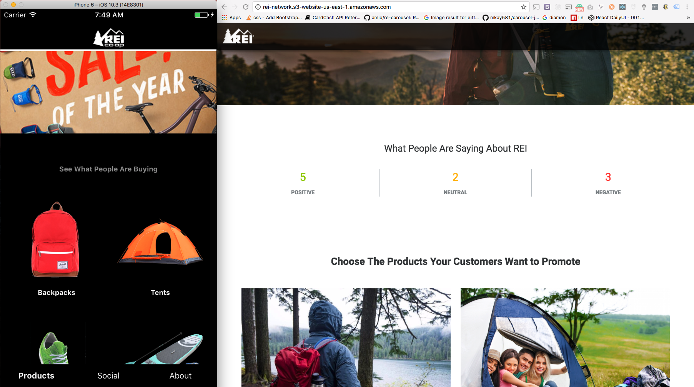

# REI Network




## Visit The Production Web App
It's live here: http://rei-network.s3-website-us-east-1.amazonaws.com

## Run Locally
```
git clone https://github.com/gdomorski/rei-web
cd rei-web

# API Server
cd force_server
npm install
npm start

# Web App
cd ../web-app
npm install
npm start


# Native App
git clone https://github.com/gdomorski/rei-native
cd rei-native
npm install
react-native run-ios
```
> **NOTE:** both the Web App and the Native App require the API server to be running


-----TWITTER STREAMING API RATE LIMITING INFO----
https://dev.twitter.com/streaming/overview/connecting

In a real app, we'd have a fewer number of long running connections for many keywords, and then on our server we'd filter the Tweets based on what keywords they applied to, and then store the tweets appropriately in our database, and then from there add them to the appropriate feeds in the Native App.

### System requirements
- Node Version 8.4.0
- XCode

## Why I Believe the REI Network is valuable for both consumers and the business

Recreational Equipment, Inc. (REI), was formed by a group of 23 mountain climbing buddies who loved to get outside and play, and know first-hand the importance of quality outdoor gear. Whether you're new to outdoor adventure or a seasoned pro, the “Brand Promise” walking into an REI Co-Op store or going online at REI.com, is that you are going to be getting expert advice from someone who has used it on the trails, slopes and waterways where they play.

They have remained true to that philosophy over the years building what is today the nation's largest consumer cooperative. They invite all who want to experience, and love the outdoor lifestyle to join them as a Co-Op member.
Each year, REI donates millions of dollars to support conservation efforts nationwide and sends dedicated teams of volunteers—members, customers and REI employees—to build trails, clean up beaches, restore local habitats and more. Through responsible business practices across the company, they strive to reduce their environmental footprint and be good citizens. All of this re-enforces who they are.

Just as their gear, class and social feedback loop has evolved, so to have the methods their customers want to communicate with them. That is why REI has continued to personalize their web site and increase their apps based on the experiences and feedback of their customers. Their customers by definition are mobile. Many are on a bike, a kayak, or on a mountain.  Mobile searches now account for well over half of all search queries.  Smartphones are the communications tool of choice.  Digital Assistants such as Alexa, Siri, Cortana, and Google Assistant are increasing being embedded in new apps.
REI’s core purpose guides everything they do: they work to inspire, educate and outfit for a lifetime of outdoor adventure and stewardship. Customers know they are not just communicating with a company that just wants to sell them gear. They are embracing a life style and joining a Co-Op of likeminded individuals with a passion for the outdoors and the next great adventure.  No matter how large they grow, their roots remain firmly planted in the outdoors. Their passion for adventure is evident, whether you visit any of their stores, phone or interact with them online.

More powerful then a $5 million dollar Super Bowl ad is the voice of another user who has experienced the product on a similar pursuit. The best source of advertising for a company is word of mouth or social media. The REI Network, an application that I am presenting today, utilizes the Twitter API along with the power of artificial intelligence from SalesForce's Einstein API's to bring the real life social experiences to the search query.  Whether it is product feedback, where the next big event will be or what’s the weather like on the mountain you are planning to hike, the REI Network will provide unique, direct customer feedback.

Today someone interested in similar information would have to go through page after page of search results, many of which are very dated.  That information is primarily press releases, spam, dated reviews and other none related information. Many of these approaches are valuable in brand recognition and leading to more sales, but they are also extremely costly and biased, and slow.  Mobile users won’t bother with that.

Instead, through the power of SalesForce's Einstein API's and social media, users can see what others are saying NOW.  When customers love a product they enjoy sharing it with the world.  My goal in creating this application was to empower the voice of customers who love products and better understand the frustrated ones who don't.

When consumers download the mobile application, they are instantly
greeted with a page that shows them what customers like about their gear. They see others like themselves using it.  They see new experiences and get instant reactions and feedback.

The same product feedback loop that has enabled REI to constantly innovate its products, and its apps, is now being applied to the user experience, through the power of the SalesForce's Einstein API's. The content engages users and creates a unique experience for them.

SalesForce's Einstein API's AI will make search more personal than ever, as it creates content that not only helps them, but gets them to make return visits as well. The power of the app enables REI to provide real time feedback to social media users, make suggestions and otherwise engage them in dialogue that can be shared through their personal network.  REI can also see trends with the ability to delve deeper into positive and negative comments and provide direct feedback to product groups, and other interested parties.

I am pleased to present the REI network, powered by SalesForce's Einstein API's to you today.


